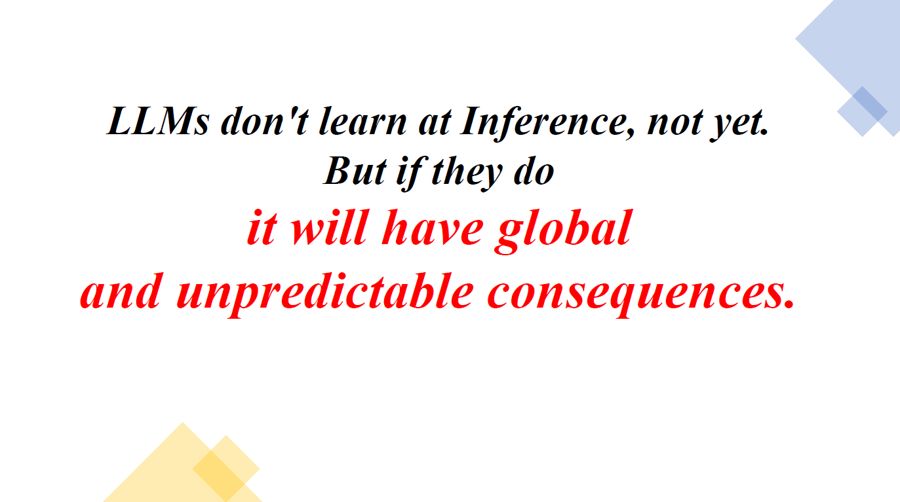

# My Master's Thesis: ***LLMs(Large Language models). Learning and reasoning at the Inference stage.***

## Abstract  

In-context learning (zero-shot learning, one-shot and few-shot learning), chain-of-
thoughts and prompt engineering have been more and more widely researched and
discussed recently, in connection with the discovered possibility of Large Language
Models (LLMs) based on examples (and in particular demonstrations of instructions,
some actions with examples, including demonstration of reasoning) to solve certain
types of problems at inference, without the need for fine-tuning, and in general with-
out any additional training of LLMs on these tasks.  

In our work, due to the lack of a general term, we refer to this emergent ability,
observed in LLMs, as the **L&R effect** (Learning and Reasoning at the Inference
Stage effect). This effect, along with the opportunities it creates, leaves open the
question of what exactly is the reason for the emergence of such a surprising ability
in LLMs.  

In this work, we summarize the available evidence and derive the necessary con-
ditions for the most striking appearance of L&R effect in LLMs – Part 2.  
Literature overview, and also conduct an analysis on the basis of which we express a number of
hypotheses about the reasons for such behavior LLMs – Part 3.  
Analytical part and we will test these hypotheses in Part 4.Computational experiment.  
  
Main questions in this work:  
  
**I. What conditions are required for L&R effect in LLMs?**  
**II. L&R effect - What is it?**  
**III. Do LLMs learn and reason at the Inference?**  
 

---

## Conclusion

<!-- In this paper we have analyzed the requirements for significant emergences
of the L&R effect (Learning and Reasoning at the Inference stage effect)
in LLMs(Large Language Models), and the conditions for the occurrence and the
strength of the emergence of the effect depending on (preferred or mandatory
conditions are written on the right):  
**1. The nature of the train dataset : Language-like dataset.**  
**2. Type of model: Transformer.**  
**3. Size of model: From 7-8B (>40-60B for accuracy >50%, on the average).**  
**4. Number of examples to train: From zero to few-shot with increasing quality.**  
**5. Size of Dataset: 300B training tokens and the size of the model is more significant.**  

## Also, we summarize:  
– observations of rule-like generalization at the inference stage, and experiments
with chain-of-thought (and prompt in general), showing **the predominant importance of train-stage learning for LLMs**, and  
– facts that validity of reasoning is only a small part of the value for performance
(pathologically incorrect examples are usually no worse than true ones),
while following the order of reasoning steps and relevance to the input query are
the key to efficiency.  

And following [21], [22], [35], we state, perhaps a bit more categorically, that
**LLMs at the Inference stage do not learn** (in the classical sense of the notion
of learning), but their ability to learn and reasoning is limited by the abilities
acquired during the train stage.  -->

---

---

---

